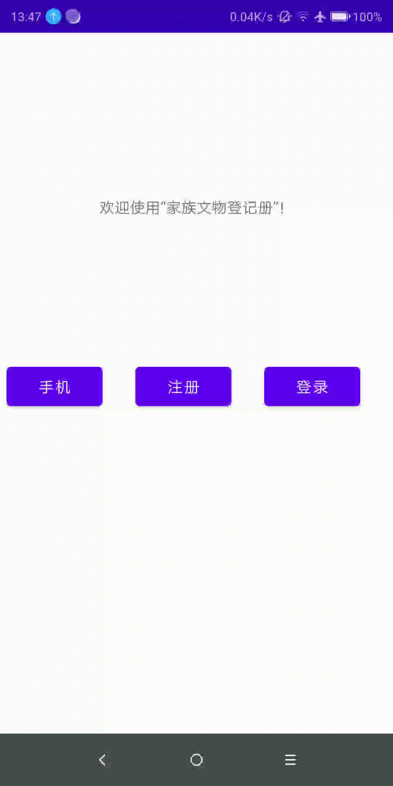
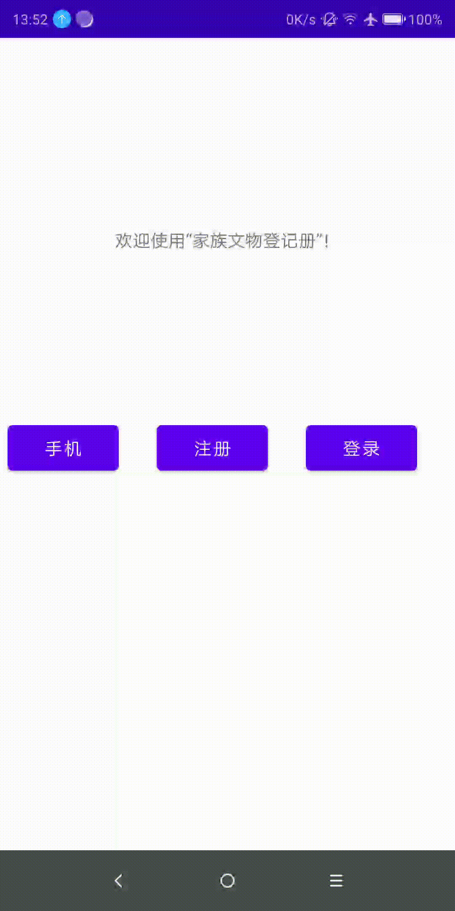
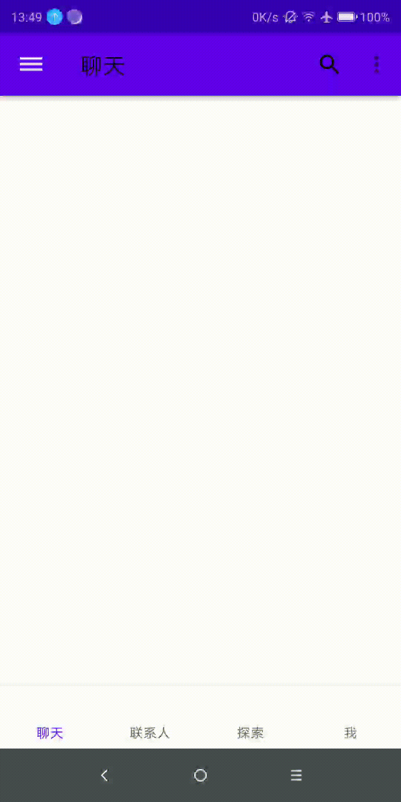
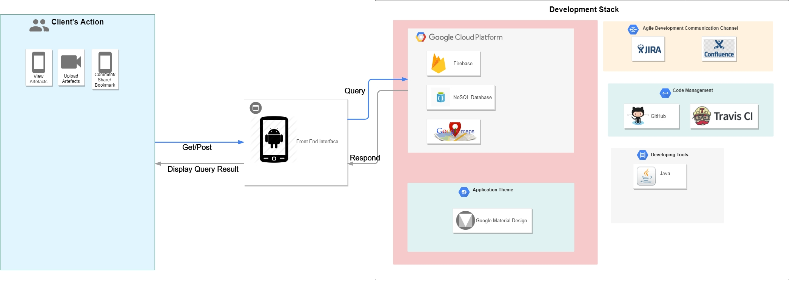

# Family-Artifact-Register
   

## Tools:
- Google Material Design: https://material.io/develop/android/docs/getting-started/
- Firebase:
- Travis (Ci):
- Images & Logos: www.pinterest.com.au

## Feature:
- User Sign In
- User Sign Up

## Screen shoots
<table border="0">
     <tr>
        <td></td>
        <td></td>
        <td></td>
     </tr>
</table>

## Architecture Design
<table>
    <tr>
        <td>Title</td>
        <td>Diagram</td>
        <td>Description</td>
     </tr>
     <tr>
        <td>HIgh-level Stack</td>
        <td></td>
        <td></td>
     </tr>

</table>
